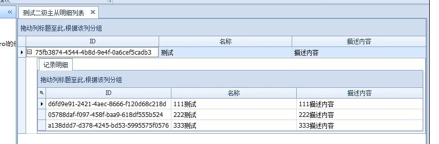

[TOC]

主要使用的是GridControl中的GridView

###### GridControl中实现主从表的显示、编辑、保存、删除

###### [实现显示](https://www.cnblogs.com/wuhuacong/p/8796898.html)

###### [保存、删除](https://www.cnblogs.com/wuhuacong/p/6530308.html)

###### GridControl中实现多个GridView的层级显示

一、定义实体类，类中含有二级数据类

二、初始化GridControl中GridView的时候，就要为GridControl添加多个GridView并有层级关系

三、绑定指定数据源，实现多层显示

如在一中设计数据源格式时，二级GridView显示列与属性集合不匹配的话，则会出现输入内容无法保存的现象，因此要注意属性值与显示列的对应；可以自定义一个实体类，用来作为显示列信息。这样输入内容后可以根据属性名称获取并进行保存。

