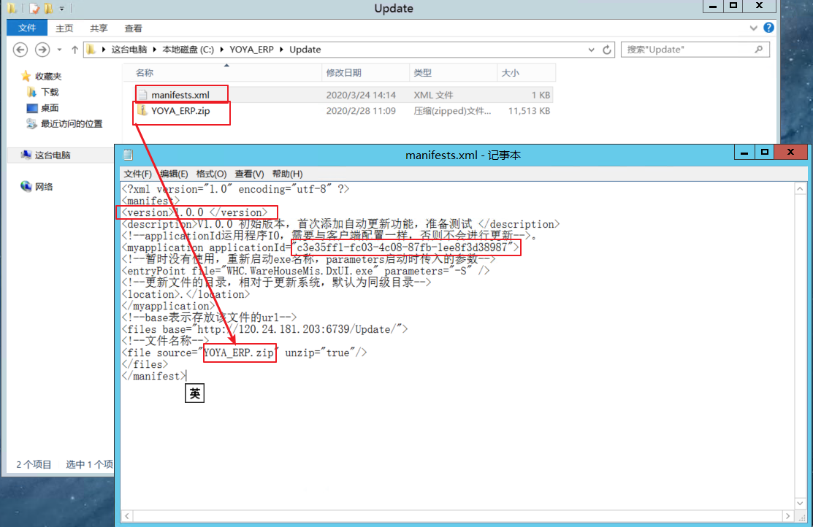

**winform开发ERP中使用了框架，集成已有的自动更新模块** 

> [伍华聪自动更新模块使用教程](https://www.cnblogs.com/wuhuacong/archive/2011/11/13/2247552.html)

###### 一、在登录页面上添加一个检查是否有新版本的后台线程

```C#
//定义检查更新的线程
private BackgroundWorker updateWorker;
updateWorker = new BackgroundWorker();
updateWorker.DoWork += new DoWorkEventHandler(updateWorker_DoWork);
updateWorker.RunWorkerCompleted += new RunWorkerCompletedEventHandler(updateWorker_RunWorkerCompleted);

//线程的运行，一般放在页面加载事件函数中执行
string strUpdate = config.AppConfigGet("AutoUpdate");
if (!string.IsNullOrEmpty(strUpdate))
{
    bool autoUpdate = false;
    bool.TryParse(strUpdate, out autoUpdate);
    if (autoUpdate)
    {
        updateWorker.RunWorkerAsync();
    }
}

//更新线程处理操作
private void updateWorker_RunWorkerCompleted(object sender, RunWorkerCompletedEventArgs e)
{
    //MessageDxUtil.ShowTips("版本更新完成");
}

//开始更新
private void updateWorker_DoWork(object sender, DoWorkEventArgs e)
{
    try
    {
        Updater.Core.UpdateClass update = new Updater.Core.UpdateClass();
        bool newVersion = update.HasNewVersion;
        if (newVersion)
        {
            if (MessageDxUtil.ShowYesNoAndTips("有新的版本，是否需要更新") == DialogResult.Yes)
            {
             Process.Start(Path.Combine(Application.StartupPath, "Updater.exe"), "121");
             Application.Exit();
            }
        }
    }
    catch (Exception ex)
    {
        MessageDxUtil.ShowError(ex.Message);
    }
}
```


###### 二、在系统设置（或其他指定地方）添加一个手动检测新版本的功能

```C#
//点击按钮检测版本是否更新
private void checkUpdate_Click(object sender, EventArgs e)
{
    Updater.Core.UpdateClass update = new Updater.Core.UpdateClass();
    try
    {
        bool newVersion = update.HasNewVersion;
        if (newVersion)
        {
            if (MessageBox.Show("有新的版本，是否需要更新", "更新提示", MessageBoxButtons.YesNo) == DialogResult.Yes)
            {
		System.Diagnostics.Process.Start(System.IO.Path.Combine(Application.StartupPath, "Updater.exe"), "121");
            }
        }
        else
        {
            MessageBox.Show("没有要更新的版本，已是最新！", "更新提示", MessageBoxButtons.OK);
        }
    }
    catch (Exception ex)
    {
        MessageBox.Show(ex.Message);
    }
}
```

###### 三、主项目运行根目录（debug）下添加系统当前版本信息，并指定唯一ID，更新文件路径等信息

```c#
<?xml version="1.0" encoding="utf-8"?>
<!--本文件为放置在客户端的“程序自动更新”模块（debug下）的配置文件，和服务端的manifests.xml配合使用-->
<applicationUpdater 
  applicationId="c3e35ff1-fc03-4c08-87fb-1ee8f3d38987" 
  manifestUri="http://120.24.181.203:6739//Update/manifests.xml" 
  version="1.0.0" title="晋江友雅生产管理系统-版本更新">
</applicationUpdater>
```

###### 四、更新配置文件的指定文件服务器中添加相应配置文件和更新文件



###### 五、在服务器（或电脑中）开启文件服务器功能，并提供其他系统使用时进行系统更新

[教程1-http文件服务器](https://www.cnblogs.com/wuy401120html/p/9219255.html)

[教程2-FTP文件服务器](https://www.jianshu.com/p/4385faf694d5)

设置完成后，测试访问：

①使用 (localhost)/127.0.0.1 + 端口号访问

②网络中心查看本机内网地址，使用内网ip+端口号访问

③使用外网ip+端口号访问

> ①②无法访问则是设置出现问题，重新设置并重启网站信息。
>
> ③无法访问可能是端口号冲突、端口未开放（阿里云端口默认关闭的，需要加入策略组）、防火墙未关闭。

