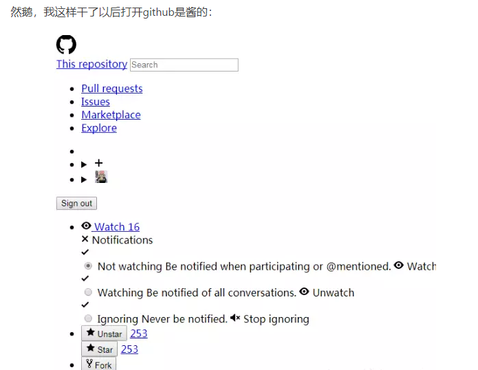

[TOC]

###### [GitHub中文排行榜](https://github.com/kon9chunkit/GitHub-Chinese-Top-Charts)

###### [HelloGitHub](https://hellogithub.com/)

##### 电脑死活登录不上GitHub网站： 

###### [解决方法](https://blog.csdn.net/qq_25973779/article/details/80030181)

###### 一、找到hosts文件

> 如果win系统下发现该路径没有hosts文件，首先打开显示隐藏文件，还是没有则可能是因为盗版系统问题没有文件，可以从有该文件的系统中拷贝过来使用。

windows下路径为：[C:](https://www.baidu.com/s?wd=C%3A&tn=24004469_oem_dg&rsv_dl=gh_pl_sl_csd)\Windows\System32\drivers\etc\hosts

Linux下路径：/etc/hosts

###### 二、为hosts文件添加内容

① 加入下列IP：（无法添加时，可复制一份出来修改后粘贴替换hosts）

192.30.253.113 github.com
192.30.253.113 github.com
192.30.253.118 gist.github.com
192.30.253.119 gist.github.com

② 如果修改后访问成功，但是出现了这种情况，则使用③

③ 去掉①中添加的内容，重新添加下面IP

 192.30.253.112 github.com
 192.30.253.119 gist.github.com
 151.101.100.133 assets-cdn.github.com
 151.101.100.133 raw.githubusercontent.com
 151.101.100.133 gist.githubusercontent.com
 151.101.100.133 cloud.githubusercontent.com
 151.101.100.133 camo.githubusercontent.com
 151.101.100.133 avatars0.githubusercontent.com
 151.101.100.133 avatars1.githubusercontent.com
 151.101.100.133 avatars2.githubusercontent.com
 151.101.100.133 avatars3.githubusercontent.com
 151.101.100.133 avatars4.githubusercontent.com
 151.101.100.133 avatars5.githubusercontent.com
 151.101.100.133 avatars6.githubusercontent.com
 151.101.100.133 avatars7.githubusercontent.com
 151.101.100.133 avatars8.githubusercontent.com

> 最后：打开GitHub则能够正常显示了。