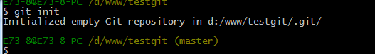

[TOC]

> 2020-01-24第一次编辑；2020-01-26初步完成

##### 一、Git是什么？

> Git是目前最先进的分布式版本控制系统。

###### 工作原理/流程：


###### 功能结构：

`WorkSpace`：工作区

`Index/Stage`：暂存区

`Respository`：仓库区（本地仓库）

`Remote`：远程仓库

###### 工作流程：

①在工作目录中添加、修改文件；   

> *文件状态：已修改(modified)* 

②将需要进行版本控制的文件放入暂存区；  

>  *文件状态：已暂存(staged)*  

③将暂存区的文件提交到本地Git仓库进行控制。  

>  *文件状态：已提交(committed)*  

##### 二、Git的下载与安装

> 下载：[官网](https://git-scm.com/downloads)  [国内镜像](https://npm.taobao.org/mirrors/git-for-windows/)  （*官网Git使用时对`Github`项目限速厉害，可使用国内镜像版*）
>
> *安装软件时注意文件夹目录不要有中文名称*

###### 下载程序并安装后，对Git应用程序进行设置（自报家门）

```Gitbash
//名称
$ git config --global user.name "Your Name"
//邮箱
$ git config --global user.email "email@example.com"
```

##### 三、Git的初次使用

###### 1、Git的初始化

①在需要初始化本地仓库的文件夹中右键选择Git Bash 或者使用命令行进入到路径；

②使用命令  `git init`  初始化本地仓库



③此时当前文件夹下多出一个名为 `.git` 的目录（默认隐藏），就是用来跟踪Git项目管理版本的；

④使用Git，对项目中文件进行操作、添加、提交等来管理版本。

附⑤ 如果在本地创建的仓库，需要同步到远程，则要在远程新增一个同名空仓库，与本地仓库进行关联。

> *`git remote add origin git@github.com:Shonee/learngit.git`关联origin远程库的`learngit`仓库* 

###### 2、Git连接`GitHub`远程仓库

> 如果项目需要多人协作，那么最好的方式就是建立一个远程仓库来统一管理版本；（可搭建局域网仓库）
>
> 使用前要将本地仓库与`GitHub`进行关联，支持私有项目免费五人共同协作；
>
> 本地仓库与远程仓库的传输是使用ssh的；由于是国外网站，数据传输过程会比较缓慢。

①查看用户主目录下是否有`.ssh`文件夹，没有的话需要使用 git命令 手动创建；

> *用户主目录即 git bash 控制台中执行 `cd ~` 的路径*   
>
> *创建SSH KEY：` $ ssh-keygen -t rsa -C "youremail@example.com"`*  一路回车就可以啦

②创建成功后，进入`.ssh`文件夹，两个文件其中`id_rsa` 是私钥，`id_rsa.pub`是公钥;

③登陆`GitHub`，打开`Account settings` 、`SSH Keys`页面，点击new，添加公钥到Key文本框中并添加；

④添加成功后，在项目首页获取连接，使用git clone 将项目下载至本地进行修改；

⑤修改完成后，使用命令 `git add .`、 `git commit -m ""`提交至本地仓库，使用`git push`提交至远程仓库；

> *第一次提交到远程仓库时，需要使用命令（带-u参数）：git push -u origin master* 

###### 3、Git连接码云远程仓（两个远程仓库同时使用）

> 国内码云速度较快，同样支持私有项目免费五人共同协作；
>
> 码云的本地仓库与远程仓库关联和`GitHub`基本一样。

①使用和`GitHub`同样方式进行关联，如果已经关联`GitHub`，会冲突报错，因为两者远程库名均是origin；

②使用命令 `git remote -v` 来查看仓库关联远程库信息，使用 `git remote rm origin` 移除origin远程库；

③使用新的命令同时绑定`GitHub`和码云两个远程库：

```GitBash
//连接一个名为gitee的码云远程库（learngit是项目名称）
$ git remote add gitee git@gitee.com:Shonee/learngit.git  
//连接一个名为github的GitHub远程库
$ git remote add github git@github.com:Shonee/learngit.git  
```

④设置完成后，可以再次查看远程关联信息确认同时绑定两个远程库；

⑤将修改提交至本地仓库后，分别使用命令 `git push github master` 和 `git push gitee master ` 提交至两个仓库。

##### (*)`Git`与`SVN`的生生世世

> Git 与 `SVN` 的最主要的区别是什么？

`SVN`是集中式版本控制系统，版本库是集中存放在中央服务器的，工作的时候，用的都是自己的电脑。工作时首先要从中央服务器获取最新的版本，然后进行工作，工作完成后，需要将自己完成的工作推送到中央服务器中。集中式版本控制系统是必须联网才能工作，局域网宽带够大，速度快，如果网络速度慢就会影响使用。

`Git`是分布式版本控制系统，没有中央服务器，每个人的电脑就是一个完整的版本库。可以不连接互联网，多人协作时，只要把各自修改的内容推送给其他人就可以看到相应修改。