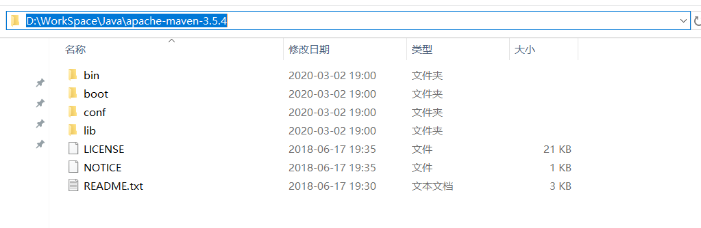
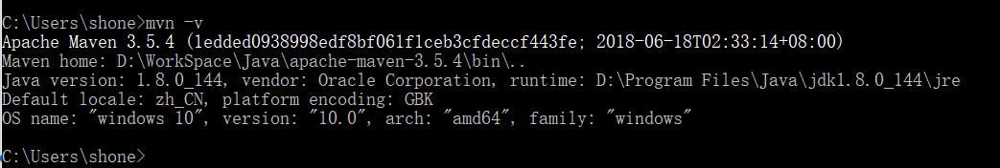
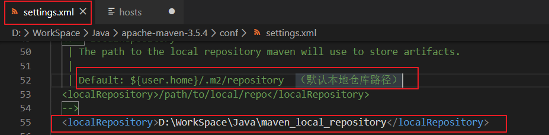
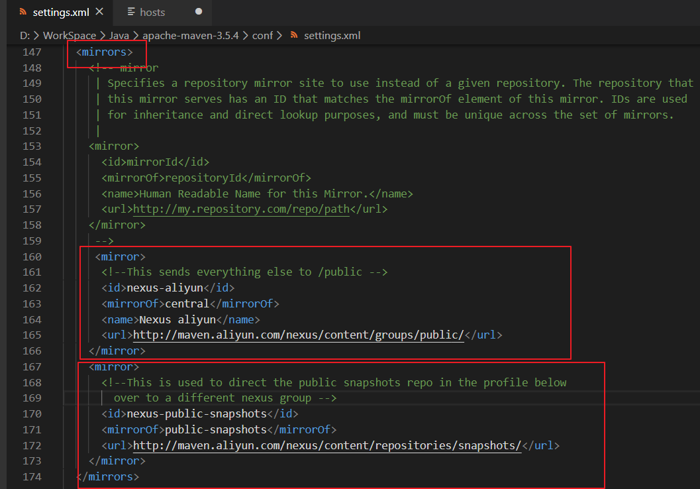
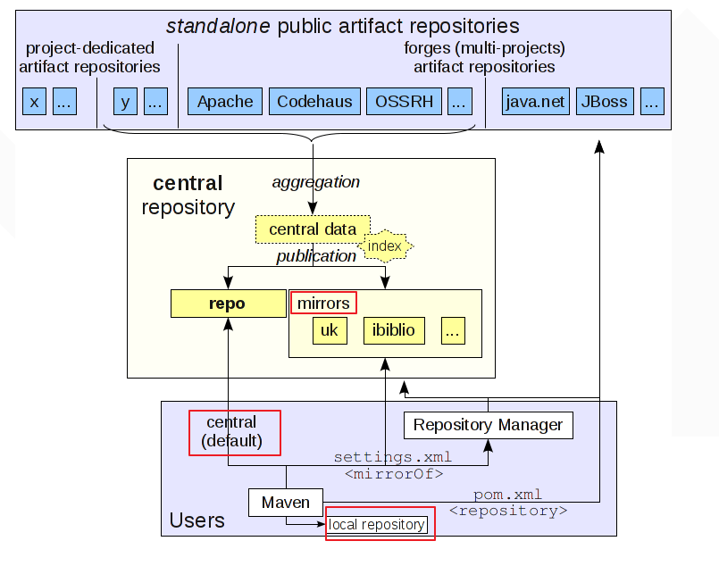
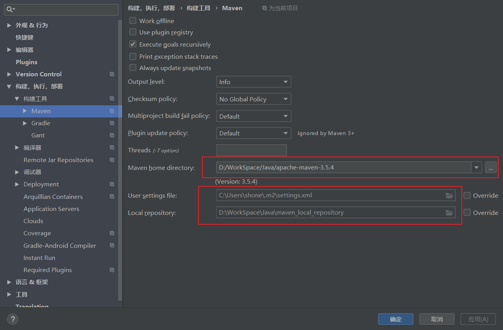

[TOC]

# Maven：自动化构建工具

[尚硅谷-Maven学习笔记](https://blog.csdn.net/zxm1306192988/article/details/76209062)

[尚硅谷-Maven学习笔记-本地保存图片](assets/尚硅谷-Maven学习笔记.jpg)

[Maven项目碰到的问题](https://blog.csdn.net/weixin_43670105/article/details/100806051)

## Maven工具的下载

#### [Maven官网下载](https://maven.apache.org/download.cgi)

## Maven工具的安装

> maven工具下载后，是一个压缩包，我们只需要将其解压后，并添加环境变量即可使用
>
> 

#### 1、解压缩文件，并放在没有中文、空格的路径下。（空格可能会引起使用错误）

####  2、找到解压后的路径，为maven添加系统环境变量

电脑右键 --> 属性 --> 高级系统设置 --> 环境变量  --> 系统变量

​	新增一个变量名：`MAVEN_HOME`  值：[maven解压路径]

​	找到系统Path变量，编辑打开，新建一个变量 `%MAVEN_HOME%\bin` 添加完成后确定

​	操作完成后，控制台使用命令 `mvn -v` 查看maven环境变量是否设置成功，返回版本信息则成功

#### 3、设置Maven的本地仓库（如果本地仓库有，则优先使用，否则去到远程下载）

> 找到maven安装目录下的conf文件夹，打开setting.xml文件，将本地仓库的路径修改到文件中，保存。

#### 4、设置远程仓库使用阿里云镜像

> 如果本地仓库中没有需要的jar包，则需要到maven远程仓库下载，为了解决外网访问慢的问题吗，使用阿里云镜像来替代外网仓库地址。

​	在第一个镜像设置中，<mirrorOf>的值为central，表示该配置为中央仓库的镜像，任何对于中央仓库的请求都会转至该镜像，用户也可以使用同样的方法配置其他仓库的镜像。另外三个元素id,name,url与一般仓库配置无异，表示该镜像仓库的唯一标识符、名称以及地址。类似地，如果该镜像需认证，也可以基于该id配置仓库认证。

​	如果<mirrorOf>的值为 `*` 号，表示该配置是所有Maven仓库的镜像，任何对于远程仓库的请求都会被转至指定的`url`地址。如果该镜像仓库需要认证，则配置一个Id为internal-repository的<server>即可。为了满足一些复杂的需求，Maven还支持更高级的镜像配置： 

​	1.<mirrorOf>*</mirrorOf> 
​	匹配所有远程仓库。 
​	2.<mirrorOf>external:*</mirrorOf> 
​	匹配所有远程仓库，使用localhost的除外，使用file://协议的除外。也就是说，匹配所有不在本机上的远程仓库。 
​	3.<mirrorOf>repo1,repo2</mirrorOf> 
​	匹配仓库repo1和repo2，使用逗号分隔多个远程仓库。 
​	4.<mirrorOf>*,!repo1</miiroOf> 
​	匹配所有远程仓库，repo1除外，使用感叹号将仓库从匹配中排除。 

> 需要注意的是，由于镜像仓库完全屏蔽了被镜像仓库，当镜像仓库不稳定或者停止服务的时候，Maven仍将无法访问被镜像仓库，因而将无法下载构件。

#### 5、IDEA中使用本地Maven程序

Maven配置完成后，打开IDEA，文件 --> 设置 --> 构建，执行，部署 --> 构建工具 --> Maven：

选择本地Maven安装目录，下面两个引用会自动更新。

同时在Maven --> Runner中设置 VM Options： `-DarchetypeCatalog=internal`  保存设置后退出