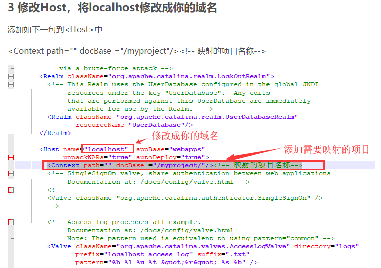

[TOC]

###### 服务器部署配置：

IP：47.105.133.126

远程登录密码：liuwei951020

实例登录账号：root

密码：常用密码

###### [Tomcat中配置公网IP或者域名](https://blog.csdn.net/neverever01/article/details/78246337)

###### [Tomcat配置实现不输入端口号访问网站](https://blog.csdn.net/SunmmerSoftware/article/details/83782587)

###### 服务器Linux系统操作：

###### **文件和目录** 

cd /home 进入 '/ home' 目录' 
cd .. 返回上一级目录 
cd ../.. 返回上两级目录 
cd - 返回上次所在的目录 
pwd 显示工作路径 
ls 查看目录中的文件 
ls -F 查看目录中的文件 
ls -l 显示文件和目录的详细资料 
tree 显示文件和目录由根目录开始的树形结构
lstree 显示文件和目录由根目录开始的树形结构
mkdir dir1 创建一个叫做 'dir1' 的目录' 
rm -f file1 删除一个叫做 'file1' 的文件' 
rm -rf dir1 删除一个叫做 'dir1' 的目录并同时删除其内容 
mv dir1 new_dir 重命名/移动 一个目录 
cp file1 file2 复制一个文件 
cp dir/* . 复制一个目录下的所有文件到当前工作目录 
cp -a /tmp/dir1 . 复制一个目录到当前工作目录 
cp -a dir1 dir2 复制一个目录

###### Vim对文件的编辑操作 

vim server.xml    使用vim则打开server.xml文件

i    进入文本编辑插入操作

Esc	插入完毕后，使用Esc键退出编辑

:wq	将编辑操作保存并退出vim页面